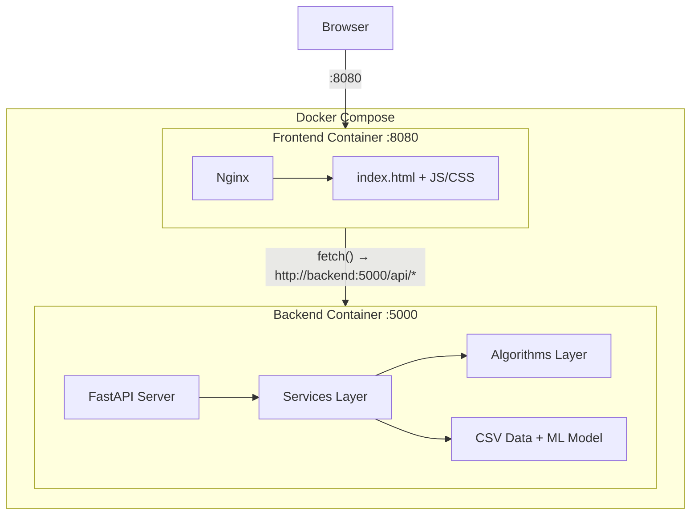
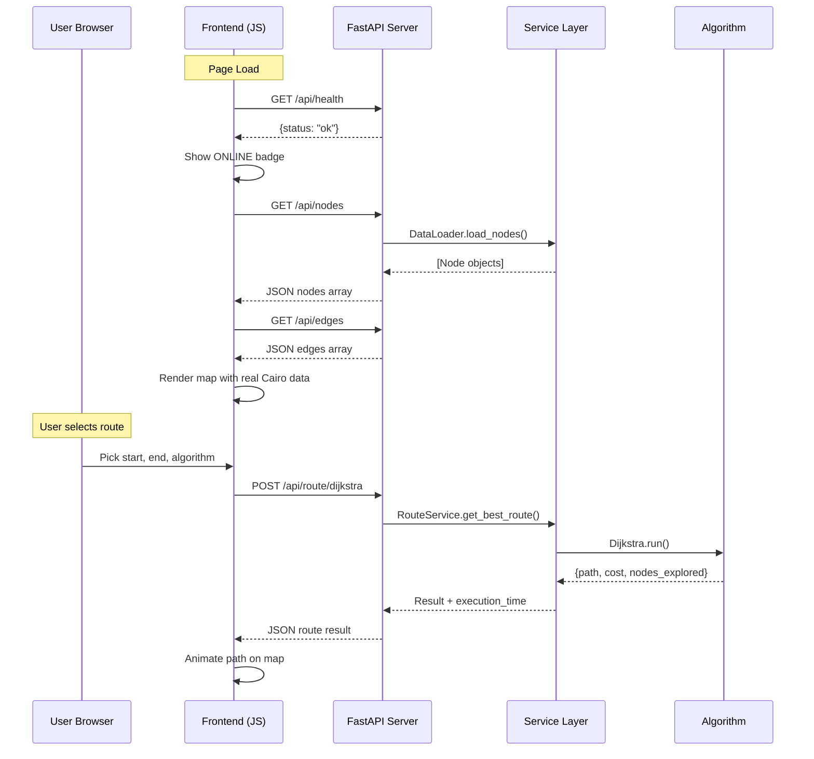

# CairoGrid-Optimizer: Full Frontend Upgrade & Backend Integration Plan

## Problem Statement

The CairoGrid-Optimizer has a mature, tested backend with Dijkstra, A*, Prim MST, Greedy traffic optimization, DP scheduling, and ML prediction. The frontend is a cinematic landing page with a basic dashboard that uses **hardcoded frontend-only Dijkstra** on **fake city nodes** (12 nodes like "maadi", "nasr_city" etc. in `ui.js`). There is **NO HTTP API server** — the backend is a CLI-only `main.py` script. The frontend has zero backend integration.

> [!IMPORTANT]
> **Critical Gap #1**: No HTTP API server exists. The backend must be wrapped in a Flask/FastAPI server before any frontend integration is possible.

> [!IMPORTANT]  
> **Critical Gap #2**: Frontend graph nodes (`ui.js` lines 16-29) are completely different from backend data nodes (IDs `1-15`, `F1-F10`). These must be unified.

---

## 1. System Architecture Overview



**Key decisions:**
- **FastAPI** over Flask (async, auto-docs, Pydantic validation, superior for API-first)
- Frontend remains vanilla HTML/JS/CSS (no build step needed)
- Nginx reverse-proxies API calls to avoid CORS in production

---

## 2. Backend: New API Server

### 2.1 New File: `Backend/api/server.py`

> [!WARNING]
> This is the **most critical new component**. Without it, nothing works.

FastAPI application exposing all backend capabilities. Required endpoints:

| Endpoint | Method | Backend Service | Purpose |
|---|---|---|---|
| `/api/health` | GET | — | Returns `{"status":"ok","timestamp":...}` |
| `/api/nodes` | GET | DataLoader | All nodes with id, name, type, x, y, population |
| `/api/edges` | GET | DataLoader | All edges with source, target, distance, capacity, traffic |
| `/api/route/dijkstra` | POST | RouteService | Dijkstra shortest path |
| `/api/route/astar` | POST | EmergencyService / AStarAlgorithm | A* heuristic path |
| `/api/route/compare` | POST | Both | Run Dijkstra + A* and return side-by-side results |
| `/api/mst` | GET | PlanningService | Prim MST edges + metrics |
| `/api/traffic/signals` | POST | TrafficService | Greedy signal optimization |
| `/api/traffic/congestion` | POST | TrafficService | Congestion index for a time period |
| `/api/traffic/predict` | POST | TrafficMLService | ML-predicted next flow for edges |
| `/api/transit/optimize` | POST | TransitService | DP scheduling/resource allocation |

#### Route Request Schema
```json
{
  "start": "1",
  "end": "3",
  "time_period": "Morning Peak",
  "mode": "normal"
}
```

#### Route Response Schema
```json
{
  "path": ["1", "3"],
  "cost": 8.5,
  "nodes_explored": 12,
  "execution_time_ms": 0.45,
  "metadata": { "mode": "shortest" }
}
```

#### Compare Response Schema
```json
{
  "dijkstra": { "path":[], "cost":0, "nodes_explored":0, "execution_time_ms":0 },
  "astar": { "path":[], "cost":0, "nodes_explored":0, "execution_time_ms":0 },
  "comparison": {
    "cost_difference": 0,
    "nodes_difference": 0,
    "time_difference_ms": 0,
    "winner": "astar"
  }
}
```

### 2.2 New Files Required

| File | Purpose |
|---|---|
| `Backend/api/__init__.py` | Package init |
| `Backend/api/server.py` | FastAPI app with all endpoints |
| `Backend/api/schemas.py` | Pydantic request/response models |
| `Backend/api/dependencies.py` | Shared graph, services (singleton startup) |

### 2.3 Backend Modifications

- **`requirements.txt`**: Add `fastapi`, `uvicorn[standard]`, `pydantic`
- **`Dockerfile.backend`**: Change CMD to `uvicorn Backend.api.server:app --host 0.0.0.0 --port 5000`
- **No changes to existing algorithm/service code** — the API layer wraps existing services

---

## 3. Frontend Redesign Architecture

### 3.1 Node Unification Strategy

**Current backend nodes** (from CSVs):
- Districts: IDs `1`-`15` (Maadi, Nasr City, Downtown, New Cairo, Heliopolis, Zamalek, 6th October, Giza, Mohandessin, Dokki, Shubra, Helwan, New Admin Capital, Al Rehab, Sheikh Zayed)
- Facilities: IDs `F1`-`F10` (Airport, Ramses Station, Cairo University, etc.)

**Current frontend nodes** (`ui.js`): 12 hardcoded fake nodes with normalized (0-1) coordinates.

**Solution**: Replace hardcoded `cityNodes`/`cityEdges` with data fetched from `/api/nodes` and `/api/edges`. Map real GPS coordinates (lon/lat from CSV) to canvas positions using min-max normalization. The backend data already has reasonable Cairo geography.

**Coordinate mapping** (from CSV `X-coordinate` = longitude, `Y-coordinate` = latitude):
- X range: 30.94 → 31.80 (longitude)  
- Y range: 29.85 → 30.11 (latitude, inverted for canvas)

### 3.2 New Frontend Module: `js/api.js`

Centralized API client module:

```javascript
const API_BASE = window.__API_BASE || 'http://localhost:5000';

export async function healthCheck() { ... }
export async function fetchNodes() { ... }
export async function fetchEdges() { ... }
export async function computeRoute(algorithm, start, end, timePeriod, mode) { ... }
export async function compareRoutes(start, end, timePeriod) { ... }
export async function fetchMST() { ... }
export async function fetchSignalPlan(timePeriod) { ... }
export async function fetchTrafficPrediction(edgeIds) { ... }
export async function fetchTransitOptimization() { ... }
```

### 3.3 Refactored `ui.js` — Component Breakdown

Replace monolithic `ui.js` (777 lines) with focused modules:

| New Module | Responsibility |
|---|---|
| `js/api.js` | All HTTP calls, error handling, timeout management |
| `js/map-renderer.js` | Canvas map drawing (nodes, edges, path animation) |
| `js/dashboard-controller.js` | Orchestrates panels, algorithm selection, state management |
| `js/comparison-panel.js` | Dijkstra vs A* split-view comparison mode |
| `js/mst-panel.js` | MST infrastructure visualization mode |
| `js/traffic-panel.js` | Greedy signal optimization visualization |
| `js/transit-panel.js` | DP scheduling visualization |
| `js/status-indicator.js` | Backend online/offline polling indicator |

### 3.4 State Management

Simple pub/sub event bus pattern (no framework needed):

```javascript
// js/state.js
const state = {
  nodes: [],           // from API
  edges: [],           // from API
  selectedAlgorithm: 'dijkstra',
  selectedStart: null,
  selectedEnd: null,
  timePeriod: 'Morning Peak',
  mode: 'normal',      // normal | emergency
  currentRoute: null,
  comparisonResult: null,
  mstResult: null,
  backendStatus: 'unknown', // online | offline | connecting
  viewMode: 'route',   // route | comparison | mst | traffic | transit
};
```

---

## 4. Dashboard HTML Redesign

### 4.1 Required UI Zones

```
┌─────────────────────────────────────────────────────────────┐
│  HEADER: Logo │ Backend Status │ Clock │ Back Button        │
├──────────┬──────────────────────────────┬───────────────────┤
│          │                              │                   │
│ CONTROL  │      MAP CANVAS              │  RESULTS PANEL    │
│ PANEL    │   (or split-view for         │  (metrics, steps, │
│          │    comparison mode)           │   comparison)     │
│ - Start  │                              │                   │
│ - End    │                              │                   │
│ - Algo   │                              │                   │
│ - Mode   │                              │                   │
│ - Time   │                              │                   │
│ - Run    │                              │                   │
│ - GMaps  │                              │                   │
│          │                              │                   │
├──────────┴──────────────────────────────┴───────────────────┤
│  ALGORITHM-SPECIFIC PANEL (MST/Traffic/Transit when active) │
└─────────────────────────────────────────────────────────────┘
```

### 4.2 Algorithm Selector UI

Add to input panel:
```html
<div class="form-group">
  <label class="form-label">Algorithm</label>
  <div class="algo-selector">
    <button data-algo="dijkstra" class="algo-btn active">Dijkstra</button>
    <button data-algo="astar" class="algo-btn">A*</button>
    <button data-algo="compare" class="algo-btn">Compare</button>
    <button data-algo="mst" class="algo-btn">MST</button>
    <button data-algo="greedy" class="algo-btn">Traffic</button>
    <button data-algo="dp" class="algo-btn">Transit</button>
  </div>
</div>
```

### 4.3 Backend Status Indicator

Replace hardcoded "LIVE" badge with dynamic status:
```html
<div class="status-badge" id="backend-status">
  <span class="badge-dot"></span>
  <span id="status-text">CONNECTING...</span>
</div>
```

Polling logic: `setInterval(() => healthCheck(), 5000)` with 3-second timeout.

### 4.4 Comparison Mode Layout

When "Compare" is selected, the map area splits into two canvases side-by-side:

```html
<div class="comparison-container" id="comparison-view" style="display:none">
  <div class="compare-half dijkstra-side">
    <div class="compare-header">⚡ DIJKSTRA</div>
    <canvas id="compare-canvas-left"></canvas>
    <div class="compare-metrics" id="dijkstra-metrics">...</div>
  </div>
  <div class="compare-divider"><span>VS</span></div>
  <div class="compare-half astar-side">
    <div class="compare-header">🧠 A*</div>
    <canvas id="compare-canvas-right"></canvas>
    <div class="compare-metrics" id="astar-metrics">...</div>
  </div>
</div>
```

**Comparison visualization features:**
- Synchronized path animation (both animate simultaneously)
- Glowing metric cards with animated counters
- Winner highlight with pulsing border
- Race-style progress bar showing which finishes first
- Nodes-explored counter animating in real-time

### 4.5 Google Maps Integration

After route computation, show button:
```javascript
function openInGoogleMaps(path, nodes) {
  const coords = path.map(id => nodes.find(n => n.id === id))
    .filter(Boolean)
    .map(n => `${n.y},${n.x}`); // lat,lon
  const origin = coords[0];
  const dest = coords[coords.length - 1];
  const waypoints = coords.slice(1, -1).join('|');
  const url = `https://www.google.com/maps/dir/?api=1&origin=${origin}&destination=${dest}&waypoints=${waypoints}`;
  window.open(url, '_blank');
}
```

---

## 5. Algorithm-Specific Frontend Behavior

### 5.1 Dijkstra / A* (Route Mode)

- Call `/api/route/dijkstra` or `/api/route/astar`
- Highlight path on map with animated particles
- Display: travel time, distance, stops, traffic level, computation time, nodes explored
- Show route steps panel

### 5.2 Compare Mode

- Call `/api/route/compare`
- Split map into two canvases
- Show both routes simultaneously with synced animation
- Display comparison metrics with animated cards
- Highlight winner

### 5.3 Prim MST Mode

- Call `/api/mst`
- Hide start/end selectors (not applicable)
- Overlay MST edges on map in distinct color (gold/amber)
- Display: total network cost, edges selected, districts connected, population reached
- Non-MST edges shown faded

### 5.4 Greedy Traffic Mode

- Call `/api/traffic/signals`
- Hide start/end selectors
- Visualize signal timings per intersection (color-coded nodes)
- Show congestion index gauge
- Display signal allocation bars per intersection

### 5.5 DP Transit Mode

- Call `/api/transit/optimize`
- Show scheduling visualization (timeline/Gantt-style)
- Display: routes optimized, passengers covered, resource allocation
- This is resource-scheduling — NOT route finding

---

## 6. Docker Integration Strategy

### 6.1 Current State Problems

- `docker-compose.yml` has no port mapping for backend
- Backend container just runs `python main.py` (CLI script, exits immediately)
- No networking between frontend and backend containers
- No CORS handling

### 6.2 Updated `docker-compose.yml`

```yaml
version: '3.8'
services:
  backend:
    build:
      context: .
      dockerfile: Dockerfile.backend
    ports:
      - "5000:5000"
    volumes:
      - ./Backend:/app/Backend
    environment:
      - PYTHONUNBUFFERED=1
      - CORS_ORIGINS=http://localhost:8080,http://frontend

  frontend:
    build:
      context: .
      dockerfile: Dockerfile.frontend
    ports:
      - "8080:80"
    depends_on:
      - backend
```

### 6.3 Updated `Dockerfile.backend`

```dockerfile
FROM python:3.11-slim
WORKDIR /app
RUN apt-get update && apt-get install -y --no-install-recommends build-essential && rm -rf /var/lib/apt/lists/*
COPY requirements.txt .
RUN pip install --no-cache-dir -r requirements.txt
COPY . .
ENV PYTHONUNBUFFERED=1
EXPOSE 5000
CMD ["uvicorn", "Backend.api.server:app", "--host", "0.0.0.0", "--port", "5000"]
```

### 6.4 Nginx Config for API Proxy

New file: `Frontend/nginx.conf`
```nginx
server {
    listen 80;
    location / {
        root /usr/share/nginx/html;
        index index.html;
    }
    location /api/ {
        proxy_pass http://backend:5000/api/;
        proxy_set_header Host $host;
    }
}
```

Updated `Dockerfile.frontend`:
```dockerfile
FROM nginx:alpine
COPY Frontend/nginx.conf /etc/nginx/conf.d/default.conf
COPY Frontend/ /usr/share/nginx/html/
EXPOSE 80
```

### 6.5 Frontend API Base URL Strategy

```javascript
// js/api.js — auto-detect environment
const API_BASE = window.location.hostname === 'localhost' 
  ? 'http://localhost:5000'  // local dev
  : '';                       // Docker (nginx proxies /api/)
```

---

## 7. Data Flow Architecture



---

## 8. Edge Cases & Error Handling

| Edge Case | Frontend Handling |
|---|---|
| Same start/end | Block submission, show warning toast |
| No route found | Show "No route available" with visual indicator |
| Backend timeout (>5s) | Show timeout error, suggest retry |
| Backend offline | Red OFFLINE badge, disable route buttons, show cached data |
| Invalid algorithm/mode combo | Disable incompatible options in UI |
| Malformed API response | Graceful fallback, console error, user notification |
| Empty path from API | "Route not reachable" message |
| Google Maps with no coords | Hide GMaps button if nodes lack coordinates |
| CORS blocked | Nginx proxy handles in Docker; dev mode uses CORS middleware |
| Docker hostname resolution | Nginx `proxy_pass http://backend:5000` uses Docker DNS |
| Missing node mapping | API returns all nodes; frontend validates against returned set |

---

## 9. Risk Analysis

| Risk | Severity | Mitigation |
|---|---|---|
| No API server exists | **CRITICAL** | Build FastAPI server first — blocks everything |
| Node ID mismatch (frontend vs backend) | **HIGH** | Fetch nodes from API, eliminate hardcoded data |
| ML model load time on startup | **MEDIUM** | Lazy-load ML service; health endpoint responds before ML ready |
| Large graph may slow canvas rendering | **LOW** | 25 nodes + 34 edges is small; no performance concern |
| Three.js import map CDN dependency | **LOW** | Already working; consider vendoring for offline |
| Frontend has no build system | **LOW** | Vanilla JS modules work fine for this scale |

---

## 10. Execution Phases

### Phase 1: API Server Foundation (Priority: CRITICAL)
1. Create `Backend/api/server.py` with FastAPI
2. Implement `/api/health`, `/api/nodes`, `/api/edges` endpoints
3. Implement `/api/route/dijkstra` and `/api/route/astar`
4. Implement `/api/route/compare`
5. Add CORS middleware
6. Update `requirements.txt`
7. **Test**: All endpoints work via curl/browser

### Phase 2: Docker Integration
1. Update `Dockerfile.backend` (uvicorn CMD)
2. Create `Frontend/nginx.conf` with API proxy
3. Update `Dockerfile.frontend` with nginx config
4. Update `docker-compose.yml` (ports, depends_on, networking)
5. **Test**: `docker compose up` launches both services, frontend reaches backend

### Phase 3: Frontend API Layer & Node Unification  
1. Create `js/api.js` (fetch wrapper with error handling)
2. Create `js/status-indicator.js` (health polling)
3. Refactor `ui.js`: Replace hardcoded nodes/edges with API data
4. Implement coordinate mapping (lon/lat → canvas)
5. **Test**: Map renders real Cairo data from backend

### Phase 4: Core Route Visualization
1. Wire Dijkstra/A* selection to API calls
2. Display all required metrics (time, distance, stops, traffic, runtime, nodes explored)
3. Add algorithm selector UI to dashboard
4. Add mode selector (Normal/Emergency)
5. Implement Google Maps button
6. **Test**: Full route flow works end-to-end

### Phase 5: Comparison Mode
1. Create `js/comparison-panel.js`
2. Implement split-view canvas layout
3. Wire to `/api/route/compare`
4. Build animated metric cards with winner highlight
5. Synchronized path animation on both canvases
6. **Test**: Side-by-side comparison is visually impressive

### Phase 6: Specialized Algorithm Views
1. MST visualization (call `/api/mst`, overlay edges, show metrics)
2. Greedy traffic visualization (signal plan, congestion gauge)
3. DP transit visualization (scheduling timeline, only if meaningful)
4. Implement `/api/mst`, `/api/traffic/signals`, `/api/transit/optimize` endpoints
5. **Test**: Each algorithm mode shows appropriate visualization

### Phase 7: ML Integration & Polish
1. Implement `/api/traffic/predict` endpoint
2. Add ML prediction overlay to traffic visualization
3. Polish all animations, transitions, spacing
4. Final edge-case testing
5. **Test**: Full demo flow, all modes, online/offline transitions

---

## 11. Technical Contradictions & Concerns

1. **`performance_evaluation.py` imports `DijkstraAlgorithm`** (line 11) but the class is named `Dijkstra` in `dijkstra.py`. This is an existing bug — won't affect our work but noted.

2. **DP algorithms are scheduling/resource-allocation**, NOT graph routing. The frontend must NOT present DP as a route-finding algorithm. It should have its own dedicated panel showing scheduling results.

3. **Greedy algorithm is signal optimization**, NOT pathfinding. The frontend must NOT force it into route mode. It should show intersection signal timing visualization.

4. **A* is used for emergency routing** via `EmergencyService` which auto-selects the nearest hospital. For general A* routing (user picks start+end), we need to call `AStarAlgorithm.run()` directly, not through `EmergencyService`.

5. **`TrafficMLService.predict_next_flow()`** accesses `edge.traffic.flows` but `TrafficProfile` uses `flow_data` not `flows`. This is an existing bug that needs fixing when we wire up the ML endpoint.

6. **Frontend uses Three.js CatmullRomCurve3 for 2D canvas curves** — unusual but works. We should preserve this pattern for consistency.

---

## 12. Files Changed Summary

### New Files (8)
| File | Purpose |
|---|---|
| `Backend/api/__init__.py` | Package marker |
| `Backend/api/server.py` | FastAPI application |
| `Backend/api/schemas.py` | Pydantic models |
| `Backend/api/dependencies.py` | Shared state/singletons |
| `Frontend/js/api.js` | HTTP client module |
| `Frontend/js/status-indicator.js` | Backend health poller |
| `Frontend/js/comparison-panel.js` | Comparison mode UI |
| `Frontend/nginx.conf` | Nginx reverse proxy config |

### Modified Files (7)
| File | Changes |
|---|---|
| `requirements.txt` | Add fastapi, uvicorn, pydantic |
| `Dockerfile.backend` | Change CMD to uvicorn |
| `Dockerfile.frontend` | Add nginx.conf COPY |
| `docker-compose.yml` | Add ports, depends_on, env vars |
| `Frontend/index.html` | Add algorithm selector, comparison container, status badge, new panels |
| `Frontend/js/ui.js` | Major refactor: remove hardcoded data, use API, add algorithm-specific views |
| `Frontend/css/style.css` | New styles for comparison mode, algorithm panels, status indicator |

### Unchanged (all existing backend code)
All algorithms, services, models, graph, data files — **zero modifications**.

---

## Open Questions

> [!IMPORTANT]
> **Q1**: The existing frontend has a cinematic intro with 3D car model, scroll-based storytelling, and team section. Should these be **preserved as-is**, or can they be simplified to get to the dashboard faster for demo purposes?

> [!IMPORTANT]
> **Q2**: The team section shows placeholder names (Alex Mercer, Sarah Chen, etc.). Should these be updated with real team member names?

> [!NOTE]
> **Q3**: The `TimePeriod` enum has 4 values (Morning Peak, Afternoon, Evening Peak, Night) but the frontend time selector only has "Morning" and "Night". Should we expose all 4 time periods in the UI?

> [!NOTE]
> **Q4**: Should we add the `potential_roads.csv` data to MST visualization (showing potential vs existing infrastructure)?
